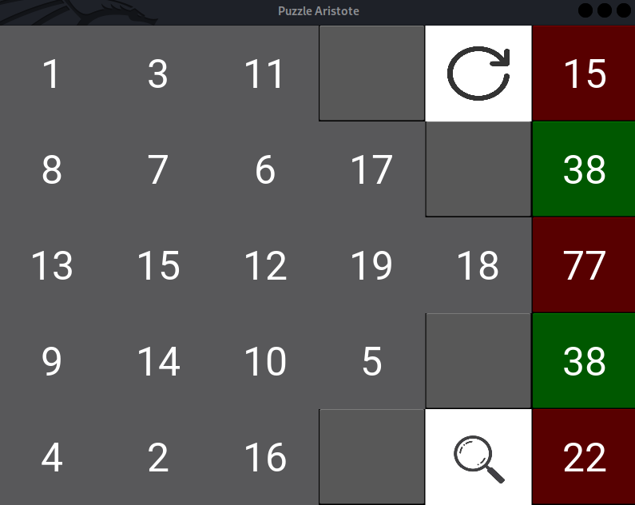

# Puzzle-Aristote

## Règle du jeu :
La somme de toutes les lignes doit être égale à exactement 38.  
Pour modifier les valeurs, on procède par échange de deux cases.  
Le joueur gagne lorsque toutes les sommes sont à 38 et le jeu d'arrête.  
Il est possible de redémarrer une partie avec l'icone flèche en haut à droite et d'afficher une solution possible avec l'icone loupe en bas à droite  



Je travaille actuellement sur la mise en place d'une case qui permettrait de demander un indice i.e. changer une seule case.

## Installation : 
Le jeu utilise kivy pour l'interface graphique. Donc, s'il elle n'est pas installée pour vous, il faut l'installer : 

```bash
pip3 install kivy
```

Pour installer le jeu et y jouer, on procède comme suit : 
```bash
git clone https://github.com/Ne0re0/Puzzle-Aristote.git
cd Puzzle-Aristote/ 
python3 Aristote-puzzle.py
```
